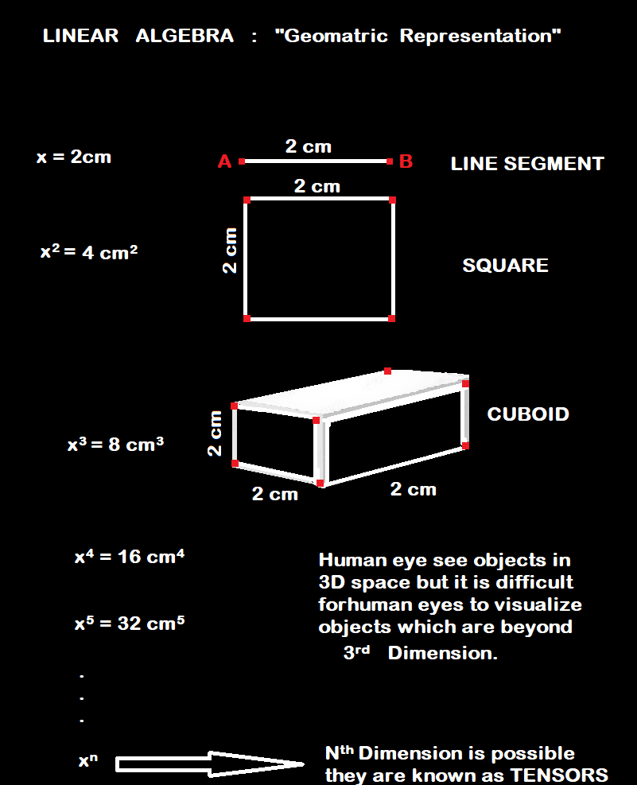

# LINEAR  ALGEBRA

Let's see the some variables with geometric intuitions and what they represent in terms of shapes.

```
x                    = 2cm
x*x                  = 4(cm*cm)
x*x*x                = 8(cm*cm*cm)
.
.
.
x*x*x*...*x (N times) = 2cm*2cm*2cm*...*2cm (upto N times)
```




- If we have x = -2cm then how we can represent negative numbers so, basically, distance cann't be negative.
But we can see it more focusly, then we found that power of even to any negative number turns it into a postive number and, power of odd to any negative number doesn't change its polarity (or) sign of that number.

- There are complex numbers "i" = (√-1) (imaginary number)
